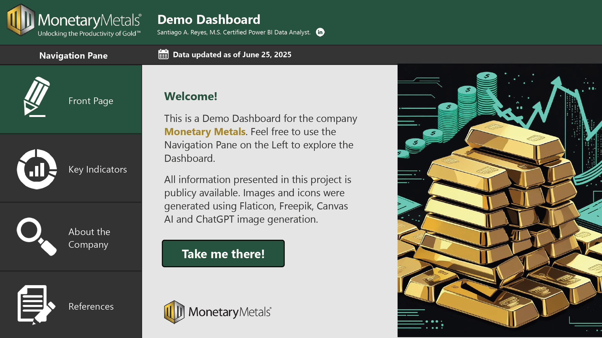
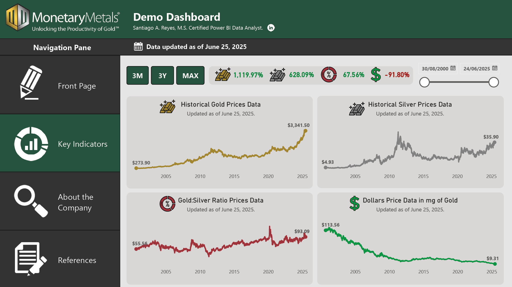
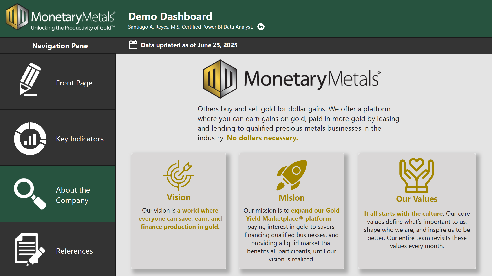
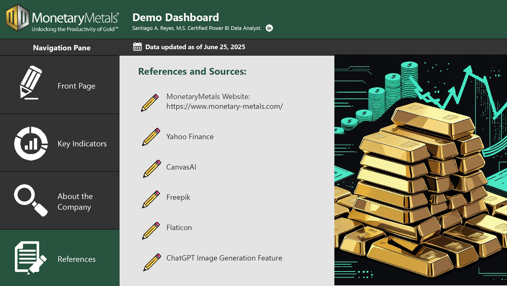
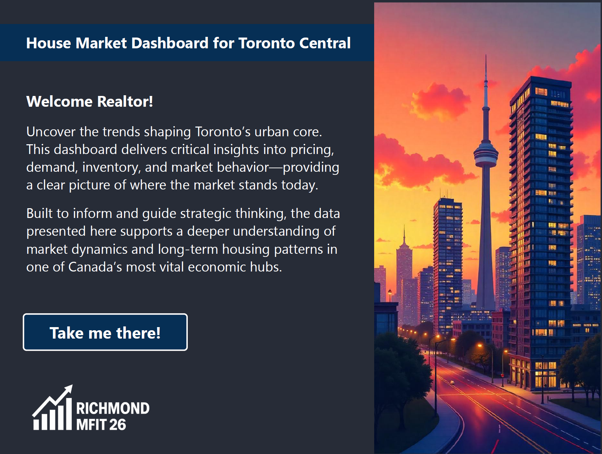
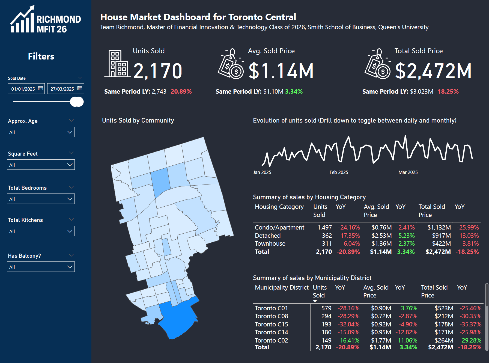

# Santiago Reyes' Portfolio

This is my personal Portfolio where I will be showcasing some of the data analytics and data visualization projects that I have developed.

All projects contain information that is publicly available. 

Feel free to reach me on my [Linkedin. ](https://www.linkedin.com/in/santiagoareyes/)

# [Project 1: Monetary Metals Demo Dashboard](https://github.com/SantiagoReyes18/Monetary-Metals-Demo-Dashboard)
This dashboard provides live-trending indicators for gold, silver, and dollar valuations over time, presented through dynamic visuals and a guided user interface. The data pipeline is fully automated, pulling updated market data directly from Yahoo Finance using Python’s yfinance package.

## Preview Snapshot: 
## Preview Snapshot: 
## Preview Snapshot: 
## Preview Snapshot: 

# [Project 2: Toronto Central Real State Dashboard](https://github.com/SantiagoReyes18/Real_State_Dashboard)

This project consist of a Real State Dashboard for Toronto Central, it was developed to visualize key real estate performance indicators. It displays metrics such as units sold, average sold price, and total sold price, with year-over-year comparisons. The dashboard features dynamic filters (e.g., property age, square footage, number of bedrooms) and interactive elements like geographic mapping, time series trends, and category breakdowns by housing type and municipality district. It was designed to deliver a clean, responsive, and user-friendly experience, supporting strategic insights through effective data storytelling.

## Preview Snapshot: 
## Preview Snapshot: 

# [Project 3: Createch Infographic](https://github.com/SantiagoReyes18/Createch-Sample-Dashboard)

This project consist of an infographic of some key information of the company Createch. The users can interact with this dashboard by switching from languages (English, French and Spanish).

## Preview Snapshot: 

# [Project 4: Kaleyra Demo Dashboard](https://github.com/SantiagoReyes18/Kaleyra-Sample-Dashboard)

This project consist of a simple financial dashboard that showcases the historical stock prices data of the company Kaleyra.

## Preview Snapshot: 
