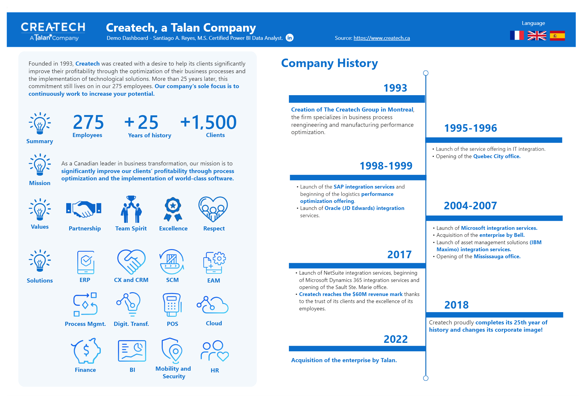
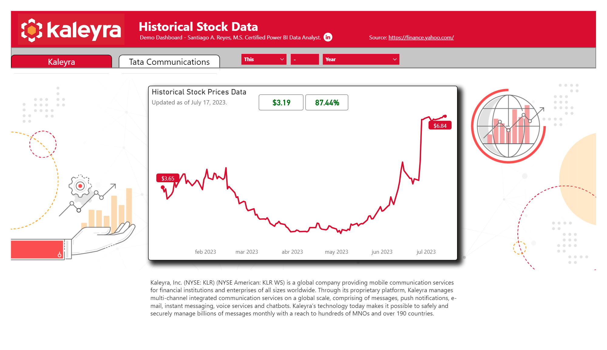

# Santiago Reyes' Portfolio

This is my personal Portfolio where I will be showcasing some of the data analytics and data visualization projects that I have developed.

All projects contain information that is publicly available. 

Feel free to reach me on my [Linkedin. ](https://www.linkedin.com/in/santiagoareyes/)

# [Project 1: Createch Infographic](https://github.com/SantiagoReyes18/Createch-Sample-Dashboard)

This project consist of an infographic of some key information of the company Createch. The users can interact with this dashboard by switching from languages (English, French and Spanish).

## Preview Snapshot: 

# [Project 2: Kaleyra Demo Dashboard](https://github.com/SantiagoReyes18/Kaleyra-Sample-Dashboard)

This project consist of a simple financial dashboard that showcases the historical stock prices data of the company Kaleyra.

## Preview Snapshot: 
